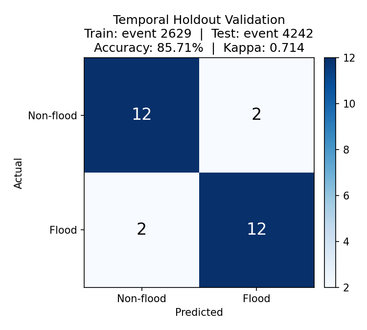
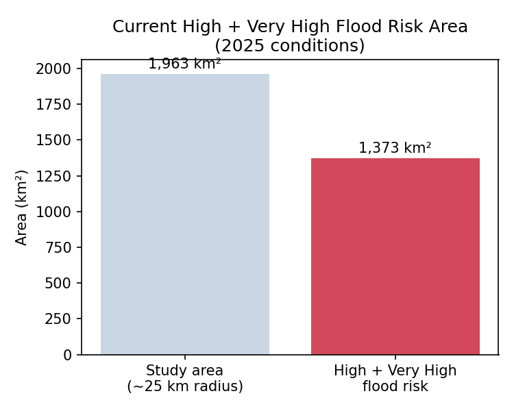
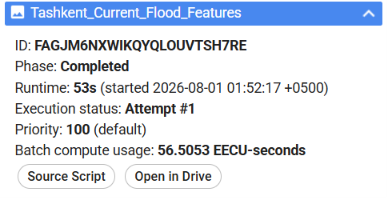
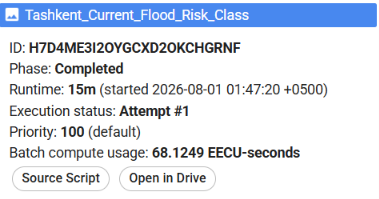
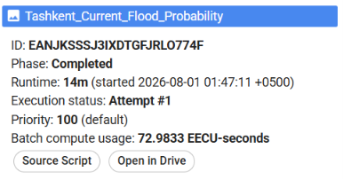

# Results

## Temporal holdout validation (train: event 2629, test: event 4242)

| Metric | Value |
|---|---|
| Overall accuracy | **85.71%** |
| Cohen's Kappa | **0.714** |
| Flood precision | 85.71% |
| Flood recall | 85.71% |
| Flood F1 score | 85.71% |
| Training accuracy | 96.43% |

Confusion matrix (test event 4242, 28 samples):

|  | Predicted Non-flood | Predicted Flood |
|---|---|---|
| **Actual Non-flood** | 12 | 2 |
| **Actual Flood** | 2 | 12 |

## Current (2025) flood risk prediction

Applying the trained model to current Sentinel-2 + CHIRPS + SRTM
conditions over the Tashkent study area:

- **High + Very High risk area: 1,372.91 km²**
- Full per-class pixel/area breakdown is in the exported
  `Tashkent_Current_Flood_Risk_Class.tif` (see `data/outputs/`).

## Exported artifacts

| File | Type | Notes |
|---|---|---|
| `Tashkent_Current_Flood_Features.tif` | GeoTIFF, 5 bands | NDVI, NDBI, NDWI, Rainfall, Elevation |
| `Tashkent_Current_Flood_Risk_Class.tif` | GeoTIFF, 1 band | 5-class risk (0=Low … 4=Very High) |
| `Tashkent_Current_Flood_Probability.tif` | GeoTIFF, 1 band | Continuous flood probability (0–1) |

All three exports completed successfully from the GEE Tasks tab:

| Task | Runtime | Compute |
|---|---|---|
|  | 53s | 56.51 EECU-s |
|  | 15m | 68.12 EECU-s |
|  | 14m | 72.98 EECU-s |

## Interpreting these numbers honestly

An 85.71% accuracy on a 56-sample, 2-event temporal holdout is a
meaningful **proof of concept**, not a production-grade flood warning
system. The gap between training accuracy (96.4%) and test accuracy
(85.7%) suggests the model has partly memorized event-2629-specific
patterns. Expanding the historical event set (beyond the 2 usable GFD
events currently available) and incorporating real drainage
infrastructure data would be the most direct ways to strengthen this
result.
